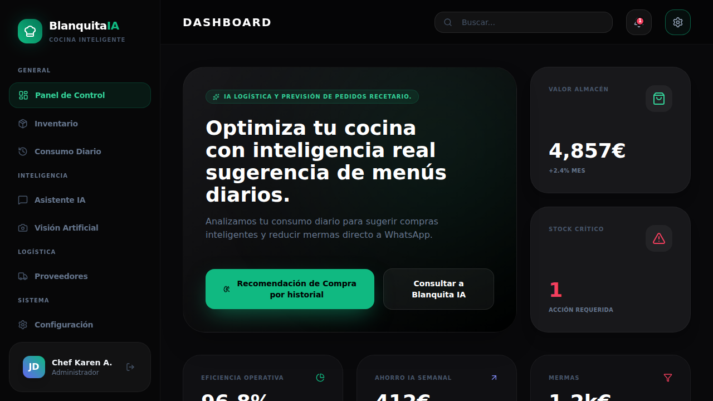

# Blanquita IA - Asistente de Cocina Inteligente

Sistema inteligente de inventario y gestión de proveedores con IA, recordatorios automáticos y escaneo visual de productos.

## Características

- **Panel de Control:** Visualización de métricas clave y eficiencia operativa.
- **Gestión de Inventario:** Control detallado de stock con alertas de nivel crítico.
- **Logística Predictiva:** Generación de órdenes de compra sugeridas basadas en el historial de consumo.
- **Asistente IA:** Chatbot especializado en análisis de inventario y sugerencias gastronómicas.
- **Visión Artificial:** Escaneo de albaranes y etiquetas para automatización de datos.

## Configuración de la API Key

Para que las funciones de IA funcionen correctamente, debes configurar tu propia Gemini API Key:

1. Inicia la aplicación.
2. Navega a la pestaña **Configuración** en el menú lateral.
3. Introduce tu Gemini API Key en el campo correspondiente.
4. Haz clic en **Guardar Configuración**.

Tus credenciales se guardarán de forma segura en el almacenamiento local de tu navegador.

## Ejecución Local

**Requisitos:** Node.js

1. Instalar dependencias:
   `npm install`
2. Iniciar la aplicación:
   `npm run dev`
3. Abre [http://localhost:3000](http://localhost:3000) en tu navegador.
